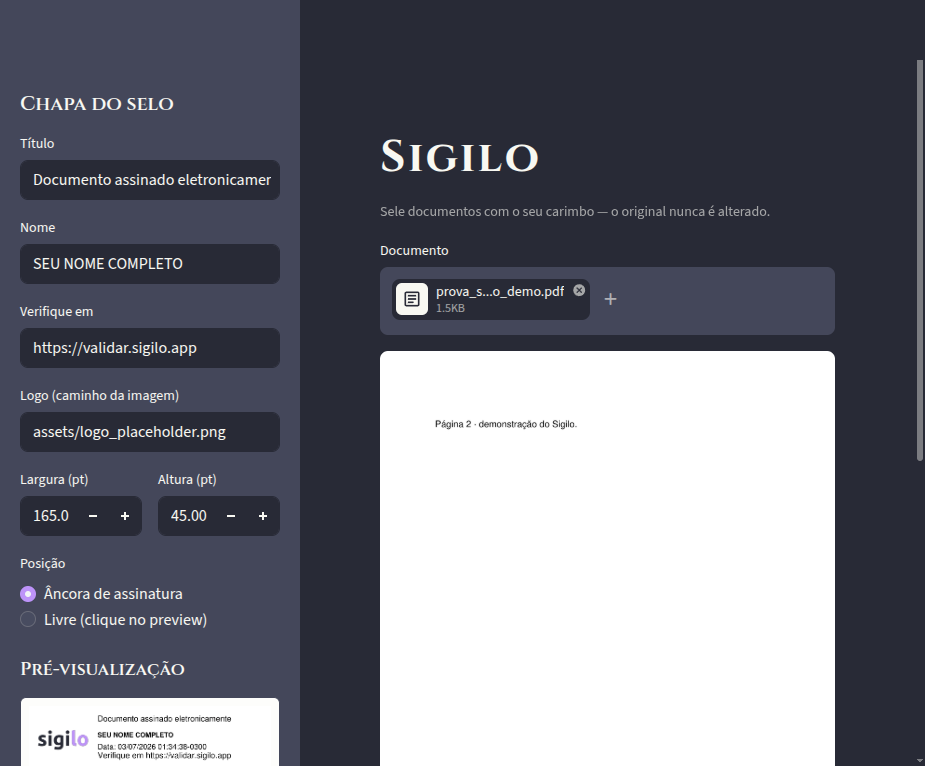

[](https://www.gnu.org/licenses/gpl-3.0)
[](https://www.python.org/)
[](CONTRIBUTING.md)

# Sigilo

**Sigilo** sela documentos com um carimbo de assinatura eletrônica: seu nome,
o timestamp exato do momento da selagem e campos totalmente configuráveis.
Nasceu no dia em que o assinador oficial do governo caiu faltando uma hora
para o prazo do relatório mensal. Nunca mais: 100% offline, sem impressora,
sem fila, sem "uws-core-5".



## Funcionalidades

*   **Carimbo com layout profissional**: estrutura visual de selo oficial —
    slot de logo à esquerda, título, nome em destaque, data e linha de
    verificação. Todas as proporções escalam com o tamanho escolhido.
*   **Campos configuráveis pela interface**: título, nome, URL de verificação
    e logo são seus — o Sigilo não finge ser nenhuma autoridade.
*   **Timestamp honesto**: sempre a data/hora do clique. Não é editável.
*   **Posicionamento**: âncora automática na página de assinatura
    (detecta a linha "Brasília/DF, ...") ou clique livre no preview.
*   **Formatos**: PDF direto; DOCX (convertido a PDF); imagens PNG/JPG.
*   **Seguro por padrão**: nunca sobrescreve o original; saída em
    `Assinados/` com sufixo `_assinado`.
*   **Interface local no navegador** (Streamlit, porta 8511) e modo linha de comando.

## Instalação

```bash
git clone https://github.com/[REDACTED]/Sigilo.git
cd Sigilo
./install.sh
```

O script instala dependências (Python, LibreOffice Writer), cria o venv
e registra o atalho no menu — que abre a interface no navegador.

## Uso

Pela interface: abra **Sigilo** no menu, escolha o arquivo, ajuste os campos
se quiser, clique em **Assinar agora**.

Pelo terminal:

```bash
./run.sh "relatorio.pdf"
# Assinado: Assinados/relatorio_assinado.pdf
```

## Nota sobre validade

O carimbo do Sigilo é uma *assinatura eletrônica simples* (Lei 14.063/2020):
identifica o signatário e o momento da assinatura, mas não é assinatura
qualificada ICP-Brasil. Para relatórios de serviço e documentos internos
costuma ser suficiente; verifique a exigência do seu destinatário.

## Desenvolvimento

```bash
./install.sh                     # ambiente completo
venv/bin/python3 -m pytest -v    # testes
```

Estrutura: `core/` (lógica pura, testável) e `ui/` (Streamlit). Veja
`CONTRIBUTING.md` para o padrão de contribuição.

## Licença

[GPL-3.0-or-later](LICENSE)
